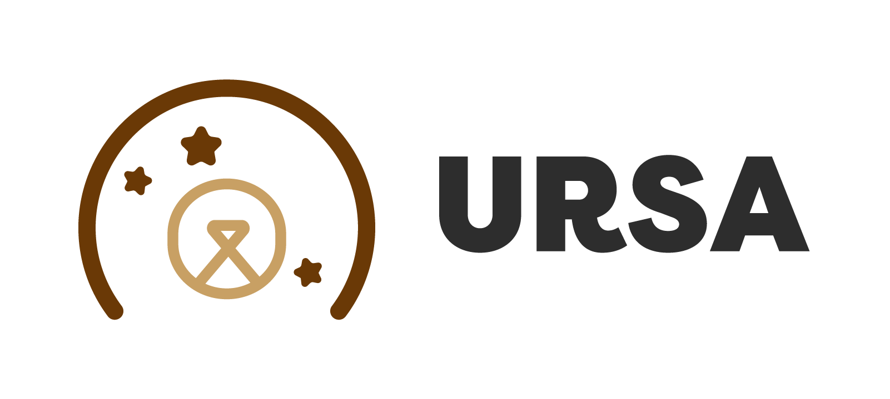

# ursa: bare-metal management daemon



ursa is management daemon for bare-metal.

The name "ursa" is derived from a Latin word that means "bear". 

## Feature

- manage bare-metal server
  - save to sqlite
- headless boot server using [iPXE](https://ipxe.org/)
  - include a some servers (dhcpd, httpd, tftpd)
- provisioning [cloud-init nocloud-net](https://cloudinit.readthedocs.io/en/latest/topics/datasources/nocloud.html) in bare-metal
  - create linux users 
  - insert user authorized keys
  - bonding network interface by ursa-bonder
  
## Getting Started

prepare a some binaries and put to `./cmd/ursa/static` .

- initrd.img
- kernel
- filesystem.squashfs

### Build

Please use `Makefile`.

```bash
$ make
```

### Put binaries and files to Server

`static` directory is DocuemntRoot in HTTP Server.

```bash
$ tree .
.
├── static
│   ├── filesystem.squashfs
│   ├── initrd.img
│   ├── kernel
│   └── ursa-bonder
└── ursa
```

### Execute ursa!

```bash
$ sudo ./ursa -iface eth0 -dhcp-range "192.0.2.100:192.0.2.200" -service-nw "198.51.100.0/24" -service-gw "198.51.100.1" -service-range "198.51.100.100:198.51.100.200"
# Listen 67/udp (DHCP), 69/udp (TFTP), 80/tcp (HTTP), so need root permission.
```

Next, you boot bare-metal server in same Layer2 Network.

It becomes...

- boot OS from `initrd.img` using iPXE.
- set IP address to bonding interface from one of `-service-range`.
- set IP address to management interface from one of `dhcp-range`.